# Diagramas entidade relacionamento

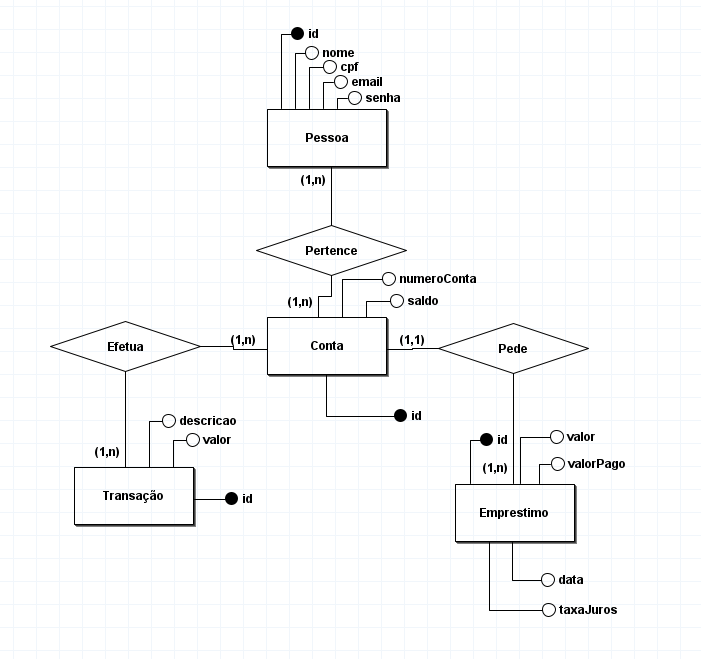
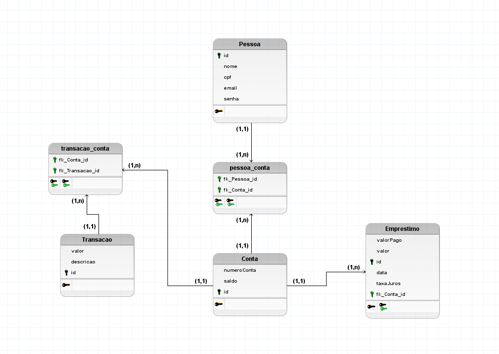

# Funcionamento do programa

## Menu inicial
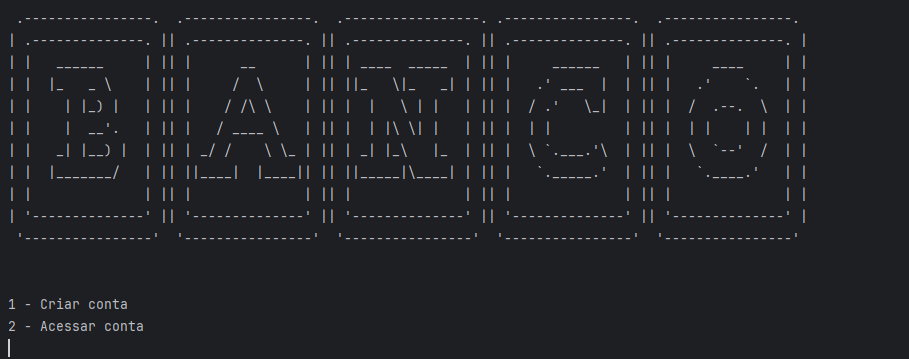
## Cadastro de pessoa e conta
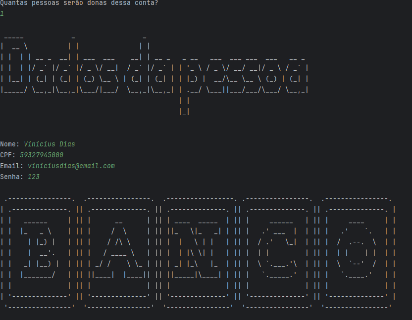
## Login
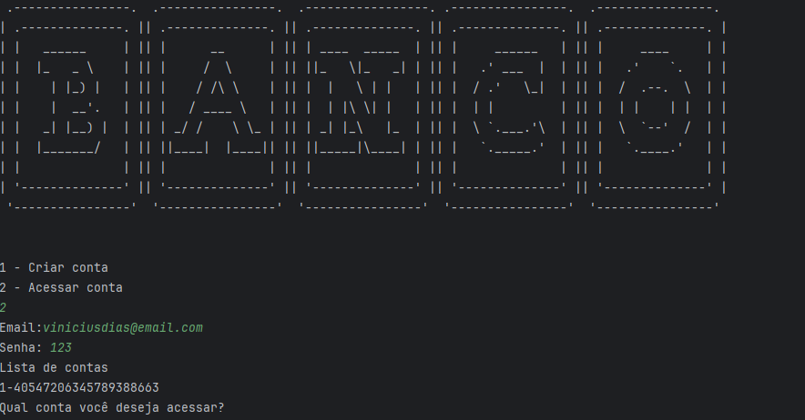
## Funcionalidades da conta
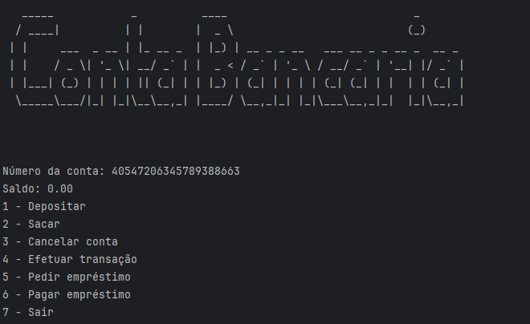
## Depósito
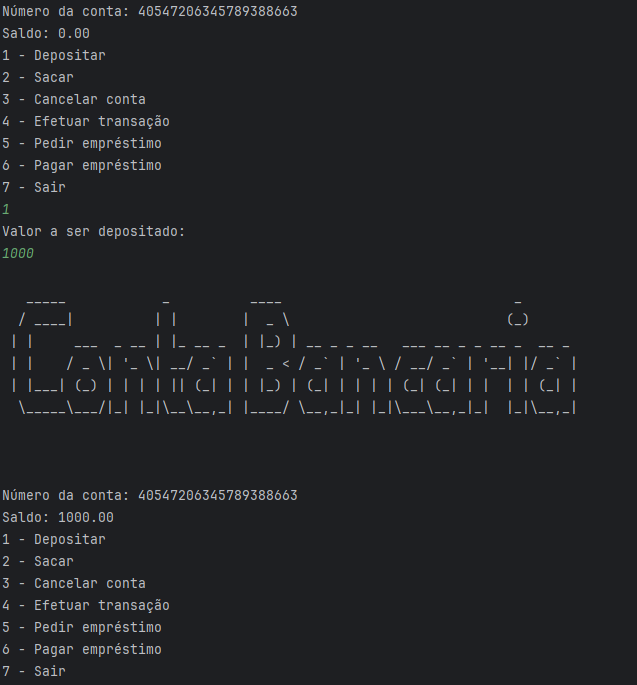
## Saque
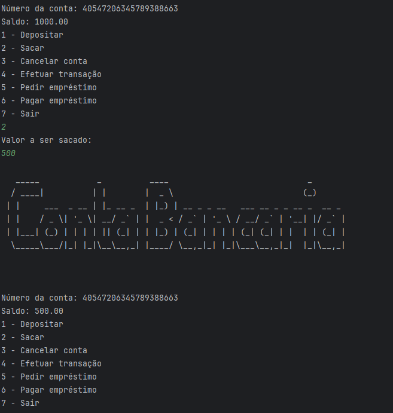
## Empréstimo
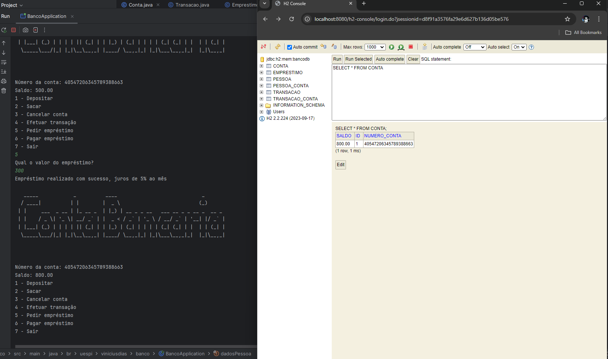
## Pagamento de empréstimo
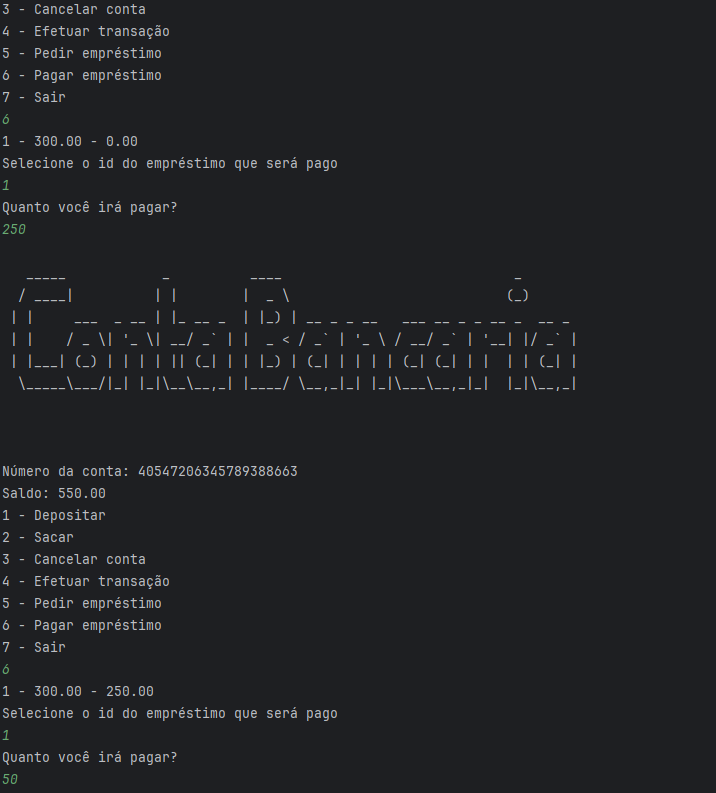
## Transação
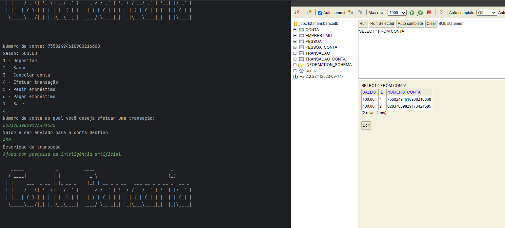
